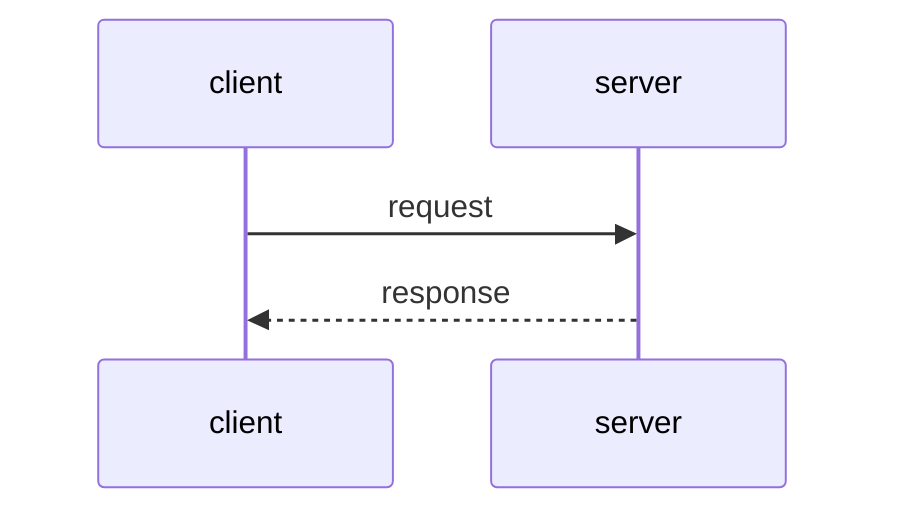

# Mermaid

## シーケンス図

コード

````text

```mermaid
sequenceDiagram
    participant client
    participant server
    client ->> server: request
    server -->> client: response
```
````

出力は以下


```mermaid
sequenceDiagram
    participant client
    participant server
    client ->> server: request
    server -->> client: response
```
