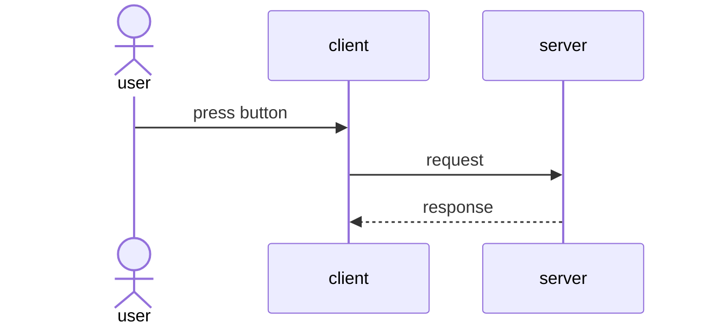
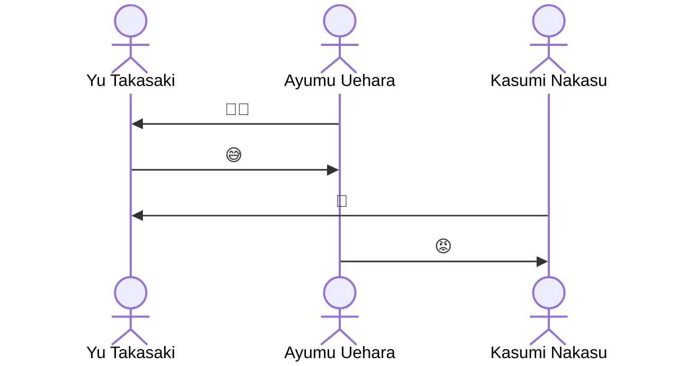
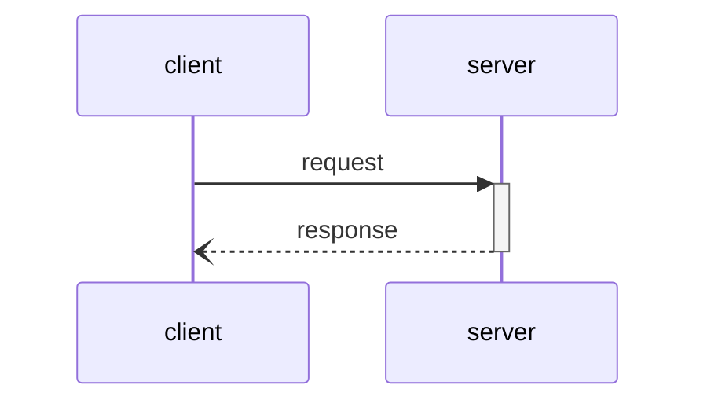
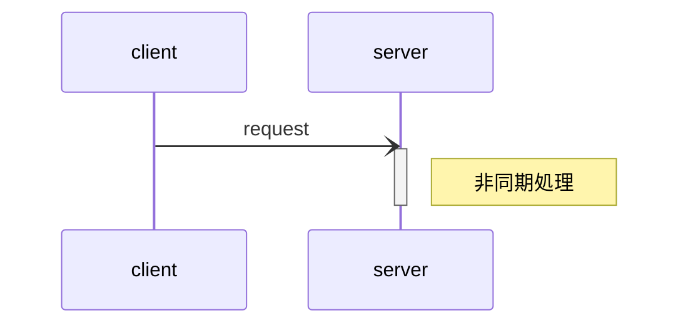

# Mermaid

## シーケンス図

コード

````text

````

出力は以下


### actor

人型(アクタ)のライフラインを描画(省略時は箱)

`as 〇〇`を付与すれば表示用の文言を設定できる。

````text

````


### participant

省略可能。箱型のライフラインを定義。  
また、冒頭部分に記述することで描画の順序を記述準に固定できる。  
`actor`同様、`as`で表示用文言を設定可能。

### 実行仕様 (activate / deactivate)

処理の実行中の長方形を描画するには、開始に`+`、終了に`-`を付与する。


`activate`と`deactivate`で明記もできる。


### 同期・非同期

同期処理

````text

````


非同期処理

````text

````


