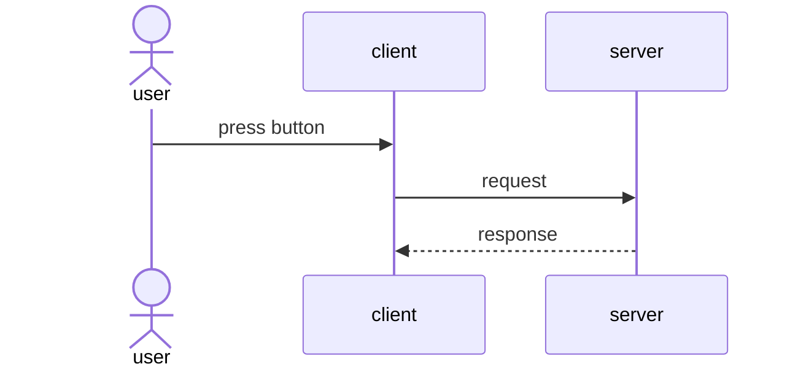
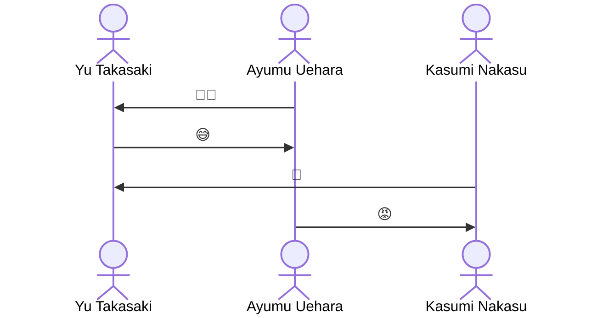
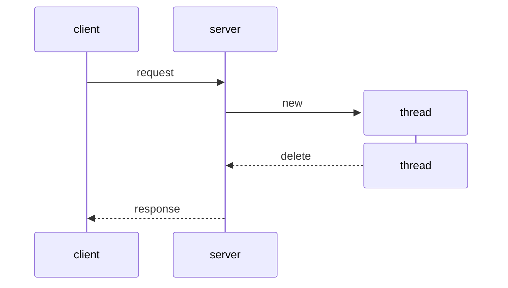
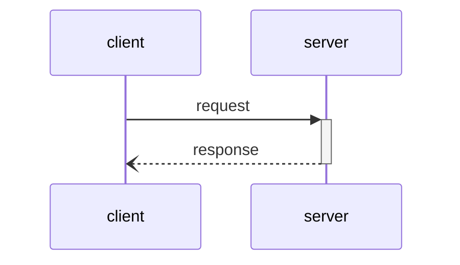
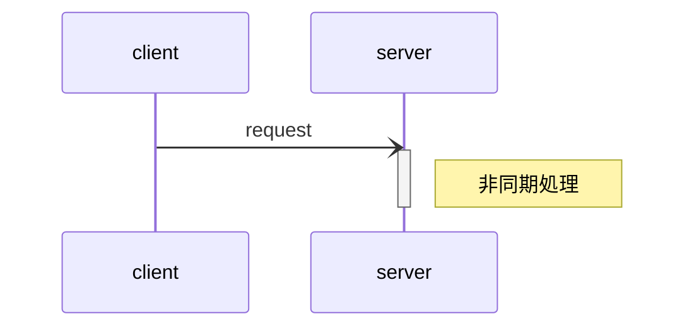
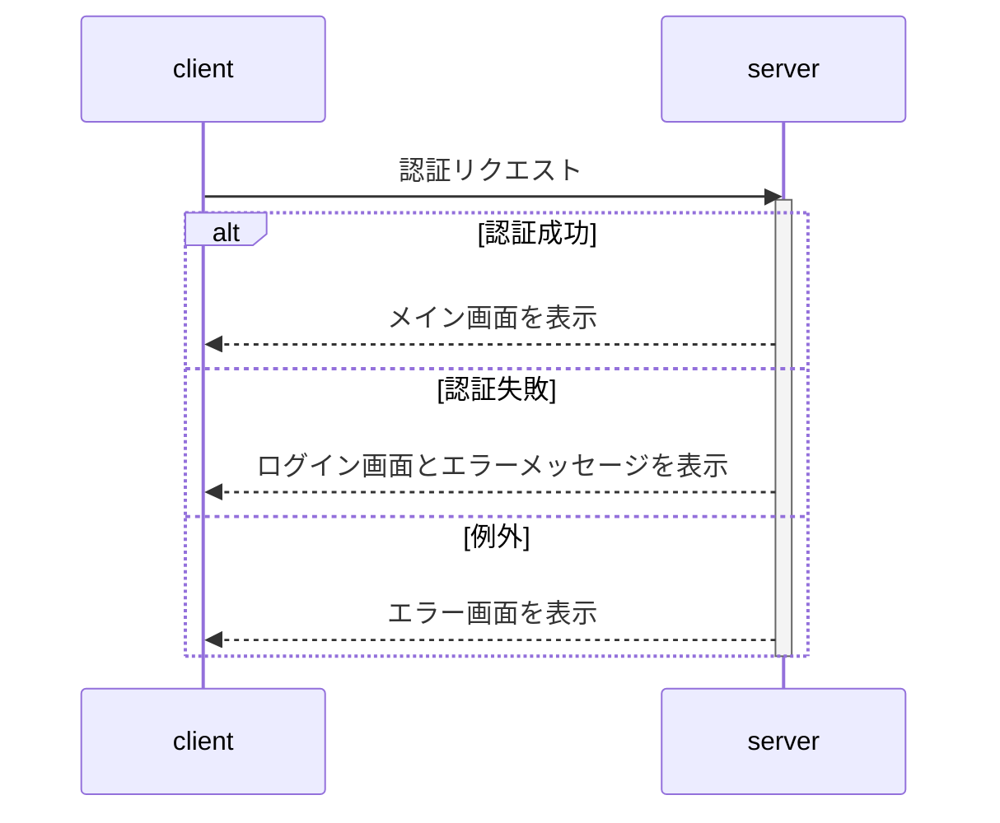
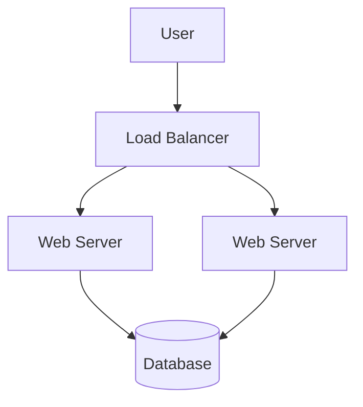
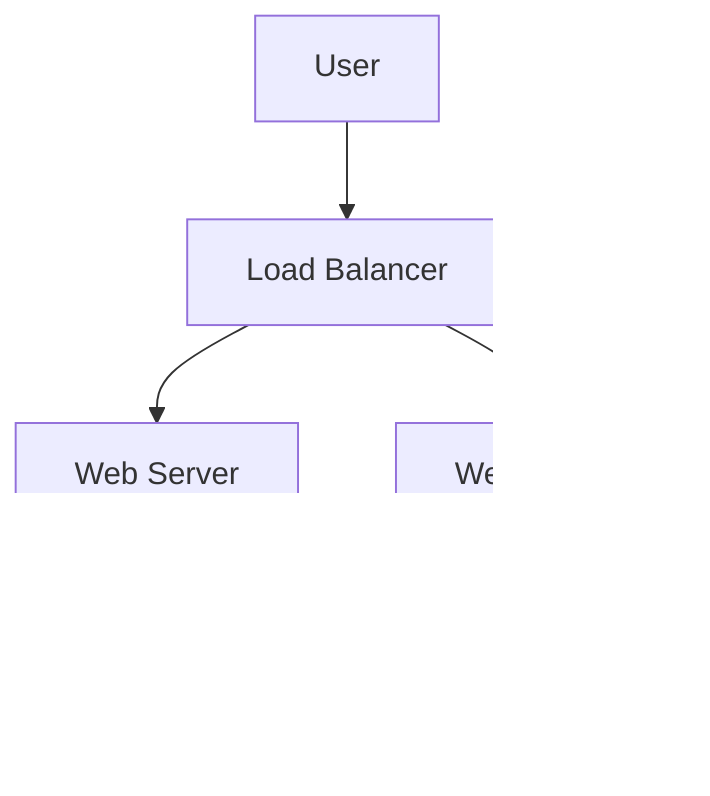

# Mermaid

## シーケンス図

[Sequence diagrams | Mermaid](https://mermaid.js.org/syntax/sequenceDiagram.html)

コード

````text

```mermaid
sequenceDiagram
    actor user
    participant client
    participant server
    user ->> client: press button
    client ->> server: request
    server -->> client: response
```
````

出力は以下


```mermaid
sequenceDiagram
    actor user
    participant client
    participant server
    user ->> client: press button
    client ->> server: request
    server -->> client: response
```

### actor

人型(アクタ)のライフラインを描画(省略時は箱)

`as 〇〇`を付与すれば表示用の文言を設定できる。

````text

```mermaid
sequenceDiagram
    actor yu as Yu Takasaki
    actor ayumu as Ayumu Uehara
    actor kasumi as Kasumi Nakasu
    ayumu ->> yu: 🥰🥰
    yu ->> ayumu: 😅
    kasumi ->> yu: 🫰
    ayumu ->> kasumi: 😡
```
````


```mermaid
sequenceDiagram
    actor yu as Yu Takasaki
    actor ayumu as Ayumu Uehara
    actor kasumi as Kasumi Nakasu
    ayumu ->> yu: 🥰🥰
    yu ->> ayumu: 😅
    kasumi ->> yu: 🫰
    ayumu ->> kasumi: 😡
```

### participant

省略可能。箱型のライフラインを定義。  
また、冒頭部分に記述することで描画の順序を記述準に固定できる。  
`actor`同様、`as`で表示用文言を設定可能。

### ライフラインの作成

`create`を宣言して開始の矢印、`destroy`を宣言して終了の矢印、の順に記載。

````text

```mermaid
sequenceDiagram
    participant client
    participant server
    client ->> server: request
    create participant thread
    server ->> thread: new
    destroy thread
    thread -->> server: delete
    server -->> client: response
```
````


```mermaid
sequenceDiagram
    participant client
    participant server
    client ->> server: request
    create participant thread
    server ->> thread: new
    destroy thread
    thread -->> server: delete
    server -->> client: response
```

### 実行仕様 (activate / deactivate)

処理の実行中の長方形を描画するには、開始に`+`、終了に`-`を付与する。

````text

```mermaid
sequenceDiagram
    participant client
    participant server
    client ->> +server: request
    server -->> -client: response
```
````


```mermaid
sequenceDiagram
    participant client
    participant server
    client ->> +server: request
    server -->> -client: response
```

`activate`と`deactivate`で明記もできる。

````text

```mermaid
sequenceDiagram
    participant client
    participant server
    client ->> server: request
    activate server
    server -->> client: response
    deactivate server
```
````


```mermaid
sequenceDiagram
    participant client
    participant server
    client ->> server: request
    activate server
    server -->> client: response
    deactivate server
```

### 同期・非同期

同期処理

````text

```mermaid
sequenceDiagram
    participant client
    participant server
    client ->> +server: request
    server --) -client: response
```
````


```mermaid
sequenceDiagram
    participant client
    participant server
    client ->> +server: request
    server --) -client: response
```

非同期処理

````text

```mermaid
sequenceDiagram
    participant client
    participant server
    client -) server: request
    activate  server
    note right of server: 非同期処理
    deactivate server
```
````


```mermaid
sequenceDiagram
    participant client
    participant server
    client -) server: request
    activate  server
    note right of server: 非同期処理
    deactivate server
```

### 条件分岐 (alt)

````text

```mermaid
sequenceDiagram
    participant client
    participant server
    client ->> server: 認証リクエスト
    activate server
    alt 認証成功
    server -->> client: メイン画面を表示
    else 認証失敗
    server -->> client: ログイン画面とエラーメッセージを表示
    else 例外
    server -->> client: エラー画面を表示
    end
    deactivate server
```
````


```mermaid
sequenceDiagram
    participant client
    participant server
    client ->> server: 認証リクエスト
    activate server
    alt 認証成功
    server -->> client: メイン画面を表示
    else 認証失敗
    server -->> client: ログイン画面とエラーメッセージを表示
    else 例外
    server -->> client: エラー画面を表示
    end
    deactivate server
```

## フローチャート

コード

````text

```mermaid
flowchart TB
  User-->LB[Load Balancer]
  LB--> Web1[Web Server] & Web2[Web Server]
  Web1 & Web2 --> DB[(Database)]
```
````


```mermaid
flowchart TB
  User-->LB[Load Balancer]
  LB--> Web1[Web Server] & Web2[Web Server]
  Web1 & Web2 --> DB[(Database)]
```
